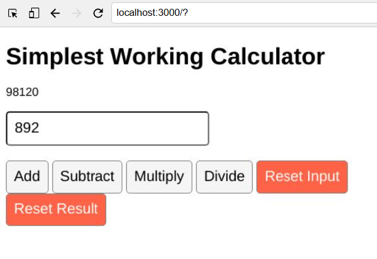

# 🧮 Simple Calculator App

A beginner-friendly React project that demonstrates how to build a functional calculator using **React Hooks** (`useState`, `useRef`).  
This app allows users to perform basic arithmetic operations such as addition, subtraction, multiplication, and division in real time.

---

## 🚀 Features
- Perform basic math operations: Add, Subtract, Multiply, Divide  
- Reset input and result fields  
- Uses React’s `useState` and `useRef` hooks  
- Simple and minimal UI

---

## 🖼 Screenshot


---

## 🛠 Tech Stack
- **React.js**
- **JavaScript (ES6)**
- **CSS3**

---

## 📦 Installation
Clone the repo:
```bash
git clone https://github.com/Rakkesh-Dev/Simple-Calculator.git
cd Simple-Calculator
